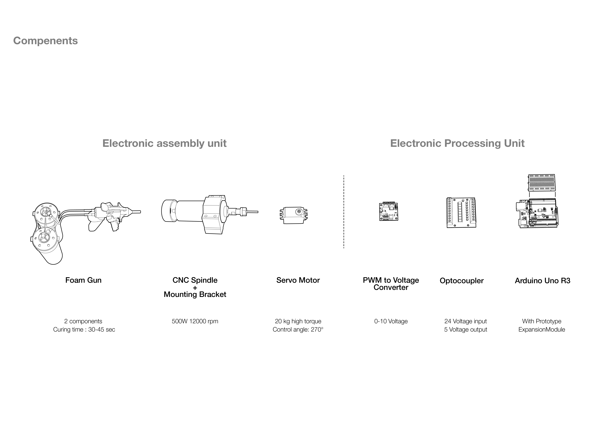

### MULTITASK PU FOAM EXTRUDER+CNC // HARDWARE I SEMINAR

## Project Description: 
The Multitask end effector is a project developed during the Hardware I Seminar of the **MRAC-20/21**-program. The objective of the seminar is to give an overview of the state of the art in robotic actuation, discuss the practical implementation of such actuators, and brainstorm how these actuators and the robotic arms could bring new levels of versatility, agility, and efficiency to the production and construction processes.

## Concept:-
The initial idea was to develop end effector which can be multitasking. Finally we decided to use PU foam for additive manufacturing and CNC milling spindle as subtractive manufacturing
 

## Components:-
Complete assembly can be divided in 2 parts;
1.	  Electronic assembly unit
2.	 Electronic processing unit - This part is responsible for processing the commands (input) and provides commands to the output devices (1st part).

## Technical Details-
Whole assembly has 2 technical divisions;
1.	  OUTPUT DEVICES - PU Foam extruder and CNC milling spindle
2.	Communication assembly
3.	Robotic control (robotic arm)

[Project Video](https://youtu.be/fueqOXTzpOA)
[Project Blog](http://www.iaacblog.com/programs/multitask-robotic-arm-end-effector-pu-foam-extruder-cnc/)

## Requirements:
# 3D parts: 
    You will need to print a direct actuating 3d printer part as per the 3d model file in the repository (documents folder). It will be required to connect the servo to the foam nozzle switch. 

# Electronics: 
    1.	Arduino Uno 
    2.	Robotic arm
    3.	Optocoupler
    4.	Jumper wires
    5.	CNC spindle (500W) with milling tip
    6.	PSU for CNC spindle
    7.	PWN to voltage converter (0-10V)
    8.	Servo motor (20 Kg/cm)
    9.	PU Foam CAN or 2 component quick drying PU foam.
    10.	12v Power supply for PWM module
    11.	Power supply for Arduino

# Schematic: 

# Software’s required:–
    Arduino IDE, MAC OS or Windows, Rhino, Grasshopper (for generating simulation code)  

# Installation instructions to usage -
    After completing the setup. Following are the requirements for input in algorithm;
    1.	Grasshopper coding – Make sure to assign proper True/false statement in tool path when the tool need to be triggered ON and OFF. When the tool is required to be triggered ON the Boolean condition for that location should be assigned as TRUE (applied to both the tools – Foam extrusion & CNC milling).

    2.	Grasshopper pin assign – While assigning wire from robotic arm optocoupler to Arduino. Please note that the Arduino has to take input from optocoupler which then will command the tools about when to turn ON & OFF. So the pins assigned on ROBOT to Optocoupler and Optocoupler to Aruino should be well noted and assigned in the grasshopper and the Arduino code properly. Do not get confused between pin of Arduino and optocoupler  

# Workflow:
    Once all the setup is finished and you are ready with the grasshopper code. You can use it over the robotic arm. Once you start with the code on robotic arm, the arm will start reading the tool path generated. Once the arm head (end effector tool) reaches the target location, robot will send a command through optocoupler to Arduino to turn on the Foam extruder and the foam extrusion will start. After completion of the required amount of foam when the robot will send extrusion turn off signal to Arduino, foam extrusion will stop. The same process will start for CNC as per the tool path defined. Please note that for this project 2 component quick drying PU foam was used. Depending on the drying time of the PU foam, you can provide delays in the grasshopper code to let the foam dry before milling over it. 
    
# References: 
[Refeference link](http://Renaissance Robotics: Novel applications of Multipurpose Robotic Arms spanning Design Fabrication, Utility, and Art by Steven J. Keating, MIT 2010)

[Refeference link](http://YHNOVA house Bouygues Bâtiment Grand Ouest, France 2018)

MULTITASK END EFFECTOR is a project of IaaC, Institute for Advanced Architecture of Catalonia. developed at **Master in Robotics and Advanced Construction** in 2019-2020 by:
Students: **Arpan Mathe, Charng Shin Chen**
Faculty: **Angel Munoz, Matthew Gordon**

# Source folder content:
1.	Arduino code
2.	Grasshopper definition
3.	3d model Rhino file

# Document folder: 
1.	Drawings reflecting details about project
2.	Schematic diagrams
3.	Images of project

          

